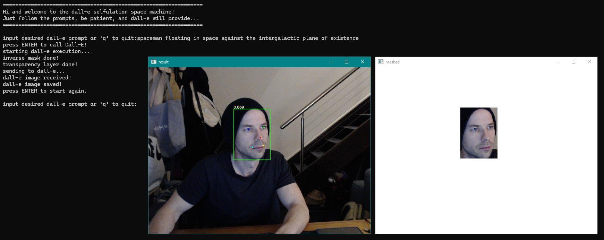
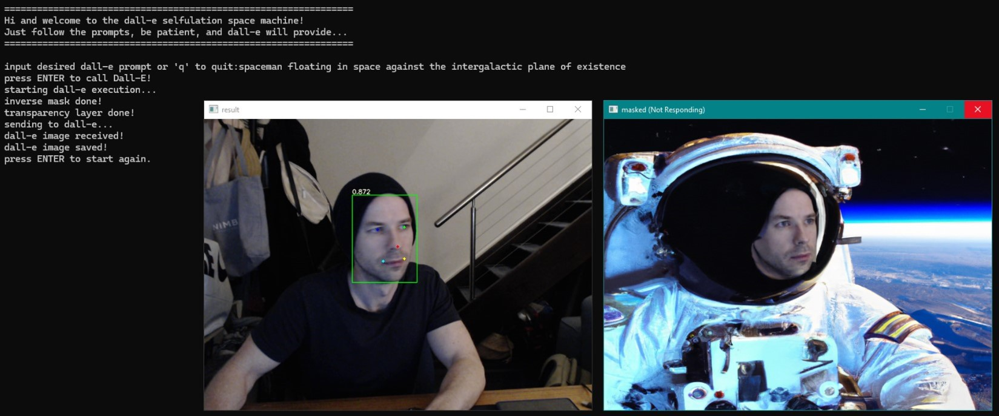

# 'Amusement Park Face Cut-Out' Generator with YOLOv5 and DALL-E Integration

This project combines YOLOv5 for real-time face detection with OpenAI's DALL-E to create custom amusement park-style face cut-out boards. It captures faces, removes the background, and uses text prompts to guide DALL-E in generating themed scenes that incorporate the detected faces, mimicking the effect of placing your face into a cut-out board at an amusement park.

## Features

- **Real-Time Face Detection**: Uses YOLOv5 to detect faces from various video sources, including webcams, RTSP streams, and video files.
- **Facial Landmark Mapping**: Identifies and marks key features on each detected face.
- **Real-Time Face Extraction**: Isolates detected faces by making non-face areas transparent, focusing solely on the face.
- **Image Masking**: Prepares faces for further processing by masking them, enabling integration with DALL-E.
- **DALL-E Integration**: Incorporates the isolated faces into custom visuals by sending them to OpenAI's DALL-E API, which generates themed scenes based on user-defined prompts.
- **Text Prompt Integration**: Allows users to guide the scene creation by providing prompts, ensuring the detected faces are incorporated into the desired context.

## Example



## Installation

1. **Clone the repository**:
   ```bash
   git clone https://github.com/famesjranko/realtime-dall-e-face-capture.git
   cd realtime-dall-e-face-capture
   ```

2. **Install the required dependencies**:
   ```bash
   pip install -r requirements.txt
   ```

3. **Set up OpenAI API key**:
   - Obtain an API key from [OpenAI](https://openai.com/).
   - Set your API key in the script (`openai.api_key = 'your_openai_api_key'`).

## Usage

1. **Running the Script**:
   ```bash
   python detect_face.py
   ```
   - `--weights`: Path to the YOLOv5 weights file.
   - `--source`: Source for video input. Use `0` for the default webcam, or provide a path to a video file or RTSP stream.

2. **Interacting with DALL-E**:
   - The script allows you to input prompts for DALL-E to generate images based on the detected and masked areas of the video feed.

## Changes Made to `utils/datasets.py`

### Problem
The original `LoadStreams` class in `utils/datasets.py` used a basic `cv2.VideoCapture` setup, which had compatibility issues and performance limitations on Windows.

### Solution
To address this, we modified the `LoadStreams` class to try multiple OpenCV backends (`cv2.CAP_DSHOW`, `cv2.CAP_MSMF`, `cv2.CAP_VFW`) when initializing video capture. This approach ensures the best possible performance and compatibility on Windows systems.

### Modified Code
Here's the modified line in the `LoadStreams` class:
```python
# Attempt to open the video source using different backends for better Windows compatibility
cap = None
for backend in [cv2.CAP_DSHOW, cv2.CAP_MSMF, cv2.CAP_VFW]:
    cap = cv2.VideoCapture(eval(s) if s.isnumeric() else s, backend)
    if cap.isOpened():
        break  # Stop if a backend successfully opens the source
```

## Additional Notes

- Ensure that you have the required OpenCV backends installed on your system. If the webcam or stream does not open, try adjusting the backend order in the script.
- This project assumes a working knowledge of Python, OpenCV, and PyTorch, as well as access to the YOLOv5 model weights.
- The DALL-E integration requires a valid OpenAI API key and available usage quota.

## Contributing

Feel free to contribute to this project

## Acknowledgements

- [YOLOv5](https://github.com/ultralytics/yolov5) by Ultralytics for the face detection model.
- [OpenAI](https://openai.com/) for the DALL-E API integration.


To align your README with the core idea of your project—using DALL-E to replicate amusement park face cut-out boards—here’s an updated version:

---


## Screenshots

*Include relevant screenshots here demonstrating the face cut-out boards generated by the system.*

## Installation

Clone the repository:

```bash
git clone https://github.com/famesjranko/realtime-dall-e-face-capture.git
cd realtime-dall-e-face-capture
```

Install the required dependencies:

```bash
pip install -r requirements.txt
```

Set up your OpenAI API key:

1. Obtain an API key from OpenAI.
2. Set your API key in the script (`openai.api_key = 'your_openai_api_key'`).

## Usage

### Running the Script:

To start detecting faces and generating cut-out boards, run:

```bash
python detect_face.py --weights <path_to_yolov5_weights> --source <video_source>
```

- `--weights`: Path to the YOLOv5 weights file.
- `--source`: Video input source (use `0` for default webcam, or provide a path to a video file or RTSP stream).

### Interacting with DALL-E:

The script allows you to input prompts for DALL-E to generate images based on the detected faces. The prompts should describe the desired scene (e.g., "a pirate ship with a cartoon character body").

## Modifications to `utils/datasets.py`

### Problem:
The original `LoadStreams` class in `utils/datasets.py` had compatibility and performance issues on Windows when using `cv2.VideoCapture`.

### Solution:
We modified the `LoadStreams` class to try multiple OpenCV backends (`cv2.CAP_DSHOW`, `cv2.CAP_MSMF`, `cv2.CAP_VFW`) for improved performance and compatibility on Windows systems.

### Modified Code:
Here's the updated line in the `LoadStreams` class:

```python
# Attempt to open the video source using different backends for better Windows compatibility
cap = None
for backend in [cv2.CAP_DSHOW, cv2.CAP_MSMF, cv2.CAP_VFW]:
    cap = cv2.VideoCapture(eval(s) if s.isnumeric() else s, backend)
    if cap.isOpened():
        break  # Stop if a backend successfully opens the source
```

### Additional Notes:
- Ensure you have the required OpenCV backends installed on your system.
- Adjust the backend order if the webcam or stream does not open correctly.

## Prerequisites

- Working knowledge of Python, OpenCV, and PyTorch.
- Access to the YOLOv5 model weights.
- A valid OpenAI API key and available usage quota.

## Contributing

Contributions are welcome! Please submit pull requests or open issues for any improvements or bugs.

## Acknowledgements

- **YOLOv5** by Ultralytics for face detection.
- **OpenAI** for DALL-E integration.

---

This updated README reflects the amusement park face cut-out concept, detailing how the system works from face detection to generating themed images with DALL-E. Let me know if you’d like any further adjustments!
